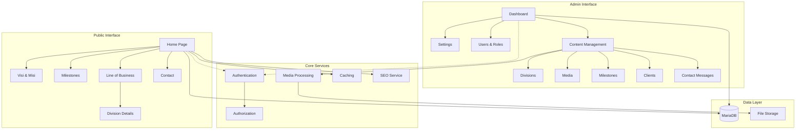

# Design Document

## Overview

The DSP Company Profile Website is designed as a modern, performant Laravel 11 application that serves both public visitors and internal content managers. The architecture follows Laravel's MVC pattern with clear separation between public-facing pages and an admin panel, utilizing Blade templating with TailwindCSS for responsive design and Vite for asset compilation.

The system is optimized for shared hosting deployment with MariaDB 11.4, featuring role-based access control, media management with automatic optimization, and comprehensive SEO capabilities. The design prioritizes performance, accessibility, and maintainability while supporting the specific workflow needs of Admin and Sales users.

## Architecture

### High-Level Architecture



### Application Structure

- **Public Routes**: Serve cached content to anonymous users
- **Admin Routes**: Protected by authentication middleware with role-based permissions
- **API Layer**: Internal APIs for AJAX operations (media upload, form submissions)
- **Service Layer**: Business logic for media processing, SEO generation, caching
- **Repository Pattern**: Data access abstraction for complex queries and caching

### Technology Stack Integration

- **Backend**: Laravel 11.45.1 with PHP 8.4
- **Database**: MariaDB 11.4 with optimized indexing
- **Frontend**: Blade templates + TailwindCSS + Alpine.js (minimal)
- **Build System**: Vite for asset compilation and optimization
- **Storage**: Local filesystem with public symlink
- **Caching**: File-based caching for shared hosting compatibility

## Components and Interfaces

### Public Components

#### HomeController
- **Purpose**: Serves the main landing page with dynamic content
- **Methods**:
  - `index()`: Aggregates hero content, slider images, about snippet, and client logos
- **Caching**: 30-minute cache for assembled page data
- **Dependencies**: SettingsService, MediaService, ClientService

#### PageController
- **Purpose**: Handles static-like pages (Visi & Misi)
- **Methods**:
  - `visiMisi()`: Retrieves and displays vision/mission from settings
- **SEO**: Dynamic meta tag generation per page

#### DivisionController
- **Purpose**: Manages line of business display
- **Methods**:
  - `index()`: Lists all divisions in grid format
  - `show($slug)`: Division detail with related products, technologies, machines, videos
- **Relationships**: Eager loads related models to minimize queries

#### MilestoneController
- **Purpose**: Displays company timeline
- **Methods**:
  - `index()`: Groups milestones by year, sorted chronologically
- **Optimization**: Single query with grouping and ordering

#### ContactController
- **Purpose**: Handles contact page and form submissions
- **Methods**:
  - `index()`: Shows contact page with company info and map
  - `store()`: Processes contact form with validation, spam protection, IP/user agent capture
- **Security**: CSRF protection, honeypot field, rate limiting
- **Validation**: Requires name + (phone OR email) + message with clear error messages

### Admin Components

#### AdminDashboardController
- **Purpose**: Provides overview and quick access to key metrics
- **Methods**:
  - `index()`: Dashboard with counts and recent contact messages
- **Widgets**: Quick stats, recent activity, system status

#### SettingsController
- **Purpose**: Manages global site configuration
- **Methods**:
  - `edit()`: Display settings form
  - `update()`: Save settings with validation
- **Storage**: JSON field in settings table for flexibility

#### UserController
- **Purpose**: User and role management (Admin only)
- **Methods**:
  - `index()`, `create()`, `store()`, `edit()`, `update()`, `destroy()`
- **Authorization**: Admin-only access with policy enforcement

#### Content Management Controllers
- **DivisionController**: CRUD for business divisions with drag-and-drop ordering
- **ProductController**: Nested under divisions with search/filter by division
- **TechnologyController**: Nested under divisions with search/filter by division
- **MachineController**: Nested under divisions with search/filter by division
- **MediaController**: Polymorphic media management with drag-and-drop reordering
- **MilestoneController**: Timeline management with drag-and-drop reordering
- **ClientController**: Client logo management with drag-and-drop ordering
- **ContactMessageController**: Inquiry management with handled status, notes, search by IP/user agent

### Service Layer

#### MediaService
- **Purpose**: Handles file uploads, processing, and optimization
- **Methods**:
  - `uploadImage($file, $entity, $type)`: Process and store images with aspect ratio validation (16:9 ±10% for hero/slider)
  - `generateWebP($imagePath)`: Create WebP variants when possible
  - `resizeImage($imagePath, $sizes)`: Generate 1920px (hero), 1280px (general), 768px (cards) with srcset
  - `uploadVideo($file)`: Handle video uploads (≤50MB mp4) or YouTube/Vimeo embed URLs only
  - `validateImageRequirements($file, $type)`: Strict validation with clear error messages
  - `stripExifAndNormalize($imagePath)`: Remove EXIF data and normalize orientation
  - `generateVideoThumbnail($videoPath)`: Create poster thumbnails for video grid cards
  - `generateHashedFilename($originalName)`: Create hashed storage paths while preserving original names
- **Features**: EXIF stripping, max dimensions (4096×4096), hashed filenames, video thumbnails, storage symlink fallback

#### SEOService
- **Purpose**: Generates meta tags, sitemaps, and SEO-related content
- **Methods**:
  - `generateMetaTags($page, $data)`: Dynamic meta tag creation with title (50-60 chars), description (120-160 chars)
  - `generateSitemap()`: XML sitemap including all public routes and division details, regenerated on content changes
  - `generateBreadcrumbs($page)`: Navigation breadcrumbs
  - `getOpenGraphImage($entity)`: Returns entity-specific image or company logo fallback
  - `generateJsonLD($page, $data)`: Create Organization/LocalBusiness structured data
  - `addStagingNoIndex()`: Add X-Robots-Tag when APP_ENV != production
- **Integration**: Works with all public controllers, includes division-specific OG images and structured data

#### CacheService
- **Purpose**: Manages application-level caching strategies
- **Methods**:
  - `cachePublicContent($key, $data, $minutes)`: Cache public page data (10-60 minutes based on content type)
  - `invalidateContentCache($type)`: Automatically clear related caches on create/update/delete
  - `warmCache()`: Pre-populate frequently accessed data
  - `handleStorageFallback()`: File copy fallback when symlink fails
  - `triggerSitemapRegeneration()`: Regenerate sitemap.xml on content changes
- **Strategy**: File-based caching with automatic invalidation and sitemap regeneration on content changes

#### SettingsService
- **Purpose**: Centralized settings management
- **Methods**:
  - `get($key, $default)`: Retrieve setting value
  - `set($key, $value)`: Update setting value
  - `getAll()`: Get all settings for forms
- **Caching**: Settings cached for 60 minutes

## Data Models

### Core Models

#### User
```php
class User extends Authenticatable
{
    protected $fillable = ['name', 'email', 'password', 'role'];
    protected $hidden = ['password', 'remember_token'];
    protected $casts = ['role' => UserRole::class];
    
    // Relationships
    public function uploadedMedia() { return $this->hasMany(Media::class, 'uploaded_by'); }
    
    // Methods
    public function isAdmin(): bool
    public function isSales(): bool
    public function canAccess(string $resource): bool
}
```

#### Setting
```php
class Setting extends Model
{
    protected $fillable = ['data'];
    protected $casts = ['data' => 'array'];
    
    // Accessor methods for common settings
    public function getCompanyName(): string
    public function getLogo(): ?string
    public function getVisi(): string
    public function getMisi(): string
    public function getHomeHero(): array
}
```

#### Division
```php
class Division extends Model
{
    protected $fillable = ['slug', 'name', 'description', 'hero_image_path', 'order'];
    
    // Relationships
    public function products() { return $this->hasMany(Product::class)->orderBy('order'); }
    public function technologies() { return $this->hasMany(Technology::class)->orderBy('order'); }
    public function machines() { return $this->hasMany(Machine::class)->orderBy('order'); }
    public function media() { return $this->morphMany(Media::class, 'mediable')->orderBy('order'); }
    
    // Scopes
    public function scopeOrdered($query) { return $query->orderBy('order'); }
    
    // Route model binding
    public function getRouteKeyName() { return 'slug'; }
}
```

#### Media (Polymorphic)
```php
class Media extends Model
{
    protected $fillable = [
        'mediable_type', 'mediable_id', 'type', 'path_or_embed', 
        'caption', 'is_home_slider', 'is_featured', 'width', 
        'height', 'bytes', 'order', 'uploaded_by'
    ];
    
    protected $casts = [
        'is_home_slider' => 'boolean',
        'is_featured' => 'boolean',
        'type' => MediaType::class
    ];
    
    // Relationships
    public function mediable() { return $this->morphTo(); }
    public function uploader() { return $this->belongsTo(User::class, 'uploaded_by'); }
    
    // Accessors
    public function getUrlAttribute(): string
    public function getWebpUrlAttribute(): ?string
    public function getResponsiveSrcsetAttribute(): string
}
```

### Supporting Models

#### Product, Technology, Machine
- Similar structure with `division_id`, `name`, `description`, `order`
- Polymorphic media relationships
- Ordered scopes

#### Milestone
```php
class Milestone extends Model
{
    protected $fillable = ['year', 'text', 'order'];
    protected $casts = ['year' => 'integer'];
    
    public function scopeByYear($query) { 
        return $query->orderBy('year')->orderBy('order'); 
    }
}
```

#### Client
```php
class Client extends Model
{
    protected $fillable = ['name', 'logo_path', 'url', 'order'];
    
    public function scopeForHomepage($query) {
        return $query->orderBy('order')->limit(12);
    }
}
```

#### ContactMessage
```php
class ContactMessage extends Model
{
    protected $fillable = [
        'name', 'company', 'phone', 'email', 'message', 
        'handled', 'note', 'created_by_ip', 'user_agent'
    ];
    
    protected $casts = ['handled' => 'boolean'];
    
    public function scopeUnhandled($query) {
        return $query->where('handled', false);
    }
    
    public function scopeSearchable($query, $term) {
        return $query->where(function($q) use ($term) {
            $q->where('name', 'like', "%{$term}%")
              ->orWhere('company', 'like', "%{$term}%")
              ->orWhere('email', 'like', "%{$term}%")
              ->orWhere('created_by_ip', 'like', "%{$term}%");
        });
    }
}
```

### Additional Model Considerations

#### Validation Rules
- **Slugs**: Unique, lowercase, hyphen-separated format with database constraints
- **Milestone Years**: SMALLINT range 1900-2100 with database constraints
- **Image Uploads**: Aspect ratio validation (16:9 ±10%) for hero/slider images, max dimensions 4096×4096
- **Video Uploads**: Domain whitelist for YouTube/Vimeo, file size limits for mp4
- **Passwords**: Minimum 8 characters, deny known weak passwords
- **Database**: utf8mb4 charset with utf8mb4_unicode_ci collation

#### Ordering and Pagination
- **Default Ordering**: All models implement `order` field with ASC sorting, milestones by `year` then `order`
- **Pagination**: 12 items per page with filter/search retention
- **Drag-and-Drop**: JavaScript-based reordering with AJAX updates for order fields

#### Database Relationships and Constraints
- **Cascade Deletes**: Division → Products/Technologies/Machines/Media, Client → Media, Media → File removal
- **Indexes**: (mediable_type, mediable_id), is_home_slider, order, (year, order)
- **Unique Constraints**: division.slug, optionally clients.name
- **Timezone**: APP_TIMEZONE=Asia/Jakarta, dates displayed as DD MMM YYYY

#### Security and Sessions
- **Login Throttling**: 5 attempts per minute with Laravel throttle
- **Session Configuration**: HttpOnly, Secure, SameSite=Lax, 60-minute idle timeout
- **Password Recovery**: Forgot password flow enabled for admin users

## Error Handling

### Public Site Error Handling
- **404 Errors**: Custom error pages with navigation back to main sections
- **500 Errors**: Generic error page with contact information
- **Form Validation**: Inline error display with field highlighting
- **Media Loading**: Graceful fallbacks for missing images

### Admin Panel Error Handling
- **Validation Errors**: Toast notifications with field-specific messages
- **Upload Errors**: Progress indicators with detailed error messages
- **Permission Errors**: Redirect to dashboard with explanation
- **Database Errors**: User-friendly messages with admin notification

### File Upload Error Handling
- **Size Limits**: Progress bar with size validation
- **Format Validation**: Preview with format requirements
- **Processing Errors**: Retry mechanism with fallback options
- **Storage Errors**: Alternative storage paths with admin alerts

### Rate Limiting and Spam Protection
- **Contact Form**: 3 submissions per minute per IP with exponential backoff
- **Honeypot Protection**: Hidden fields with JavaScript validation
- **CSRF Protection**: Token validation on all forms
- **Input Sanitization**: HTML purification with whitelist approach

## Testing Strategy

### Unit Testing
- **Model Tests**: Validation, relationships, scopes, accessors
- **Service Tests**: Media processing, SEO generation, caching logic
- **Helper Tests**: Utility functions, formatters, validators

### Feature Testing
- **Public Pages**: Content display, SEO tags, responsive behavior
- **Admin Functions**: CRUD operations, file uploads, permissions
- **Authentication**: Login, logout, role-based access
- **Contact Form**: Submission, validation, spam protection

### Integration Testing
- **Media Pipeline**: Upload → Process → Display workflow
- **Cache Invalidation**: Content updates → Cache clearing
- **SEO Generation**: Content changes → Meta tag updates
- **Permission System**: Role changes → Access control updates

### Performance Testing
- **Page Load Times**: Target <600ms TTFB
- **Image Optimization**: Size reduction verification
- **Cache Effectiveness**: Hit rate monitoring
- **Database Query Optimization**: N+1 query prevention

### Browser Testing
- **Cross-browser Compatibility**: Last 2 versions of Chrome, Edge, Safari, iOS Safari, Android Chrome
- **Responsive Design**: ≥320px (mobile), ≥768px (tablet), ≥1024px (desktop) breakpoints
- **Accessibility**: Screen reader compatibility, keyboard navigation, skip links, lang="id" attribute
- **JavaScript Functionality**: Progressive enhancement with slider controls (Left/Right, Pause/Play)

### Deployment Testing
- **Shared Hosting Compatibility**: cPanel deployment simulation with Node.js-free operation
- **File Permissions**: Storage and cache directory access with symlink fallback testing
- **Database Migration**: Schema updates and data integrity
- **Asset Compilation**: Vite build process verification with public/build/manifest.json presence
- **Error Pages**: Custom 404/500 page functionality and robots.txt serving with 200 status
- **Map Fallback**: Static map image with "Open in Google Maps" link when iframe blocked

### Additional Testing Considerations
- **Empty State Handling**: Home slider graceful hiding, division tabs conditional rendering
- **Content Limits**: Client logo display (max 12), content truncation (2 lines with ellipsis)
- **Admin UX**: Drag-and-drop reordering, search/filter functionality, confirmation dialogs
- **Form Validation**: Focus management, aria-describedby associations, clear error messaging
- **Media Processing**: EXIF stripping, orientation normalization, hashed filename generation
- **Performance Metrics**: LCP < 2.5s, CLS < 0.1, aspect-ratio boxes for layout stability
- **Security Features**: Login throttling, password policies, session security flags
- **Operational Features**: Contact message retention (24 months), CSV export, error logging

The testing strategy emphasizes automated testing where possible while acknowledging the constraints of shared hosting environments and the need for manual verification of visual and interactive elements.